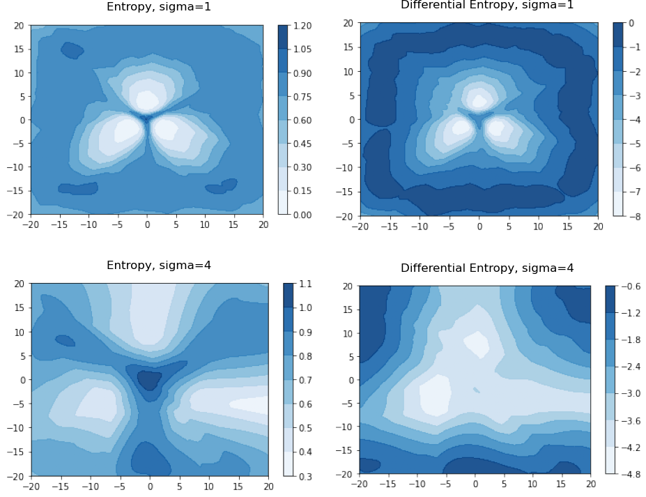

# PriorNetworks

## Updates for this fork
* Reproduce the experiments on the synthetic dataset in Section 5.1 of the [PriorNetworks paper](https://arxiv.org/abs/1802.10501).
* Add environment.yml file
* Commands for training on image datasets
* Rewrite evaluation and add new datasets

### Experiment reproduction results

<p align="center">

</p>

---

### Setup
Install conda environment 
```
conda create -f environment.yml
```

Install uncertainty eval libary
```
pip install git+https://github.com/selflein/nn_uncertainty_eval
```

Train on the Gaussian synthetic dataset
```
python prior_networks/priornet/run/train_dpn_synth.py --checkpoint_path checkpoints/dpn_synth_std4 --model_dir checkpoints/dpn_synth_std4 --lrc 10 --lrc 30 --n_epochs 1000 --lr 1e-4 --gpu 0 --std 4
```
the values of {std} (which is the variance of the Gaussians in the dataset) in the paper are 1 and 4. 

Alternatively, pretrained models can be found [here](https://drive.google.com/drive/folders/1c2JpANMImZhqxc29cCn-mlmz3B3arDok?usp=sharing). Place the `checkpoint` folder in the root of the repo.

### Generate figures 
Run the `reproduce_gaussian_exp.ipynb` notebook to generate the plots found above.


## Train on image datasets

* Setup model
  ```
  python prior_networks/priornet/setup/setup_dpn.py out/model/wideresnet28_10 32 10 --drop_rate 0.3 --arch wide_resnet28_10
  ```

* Train (Prior Network)
  ```
  python prior_networks/priornet/run/train_dpn.py ../data/ CIFAR10 CIFAR100 45 5e-4 --optimizer ADAM --normalize --rotate --augment --gamma 1. --reverse_KL False --model_dir out/model/wideresnet_28_10_forward_kl_cifar_10_cifar_100 --checkpoint_path out/model/wideresnet_28_10_forward_kl_cifar_10_cifar_100 --gpu 0 --lrc 30
  ```

* Train (Reverse Prior Network)
  ```
  python prior_networks/priornet/run/train_dpn.py ../data/ CIFAR10 CIFAR100 50 1e-4 --optimizer ADAM --normalize --rotate --augment --gamma 1. --reverse_KL True --model_dir out/model/wideresnet_28_10_reverse_kl_cifar_10_cifar_100 --checkpoint_path out/model wideresnet_28_10_reverse_kl_cifar_10_cifar_100 --gpu 0 --lrc 50
  ```

### OOD detection on image datasets
```
python prior_networks/priornet/run/ood_detect.py ../data CIFAR10 --ood_dataset SVHN --ood_dataset LSUN --ood_dataset Noise --ood_dataset SVHN_unscaled out/evals_new/reverse_all --model_dir out/model wideresnet28_10_reverse_kl_cifar_10_cifar_100_new/model/model.tar --gpu 0
```